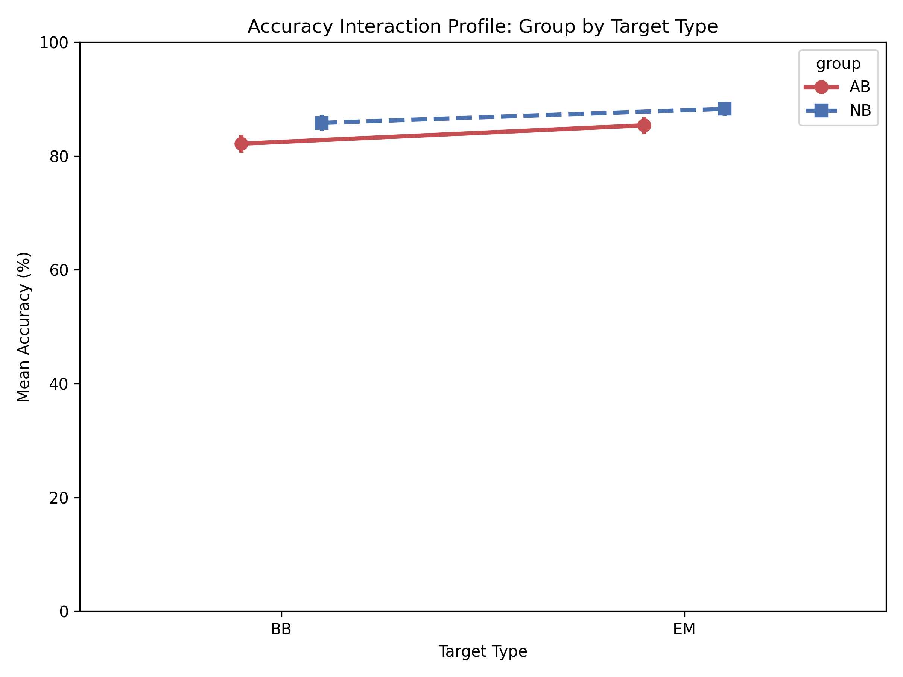
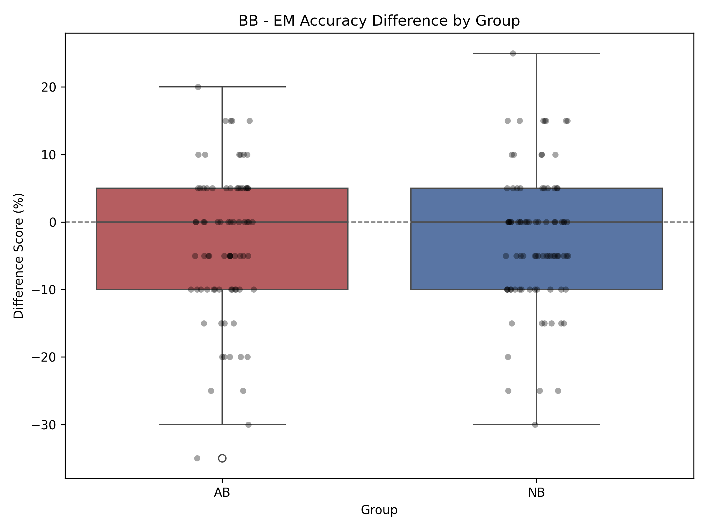
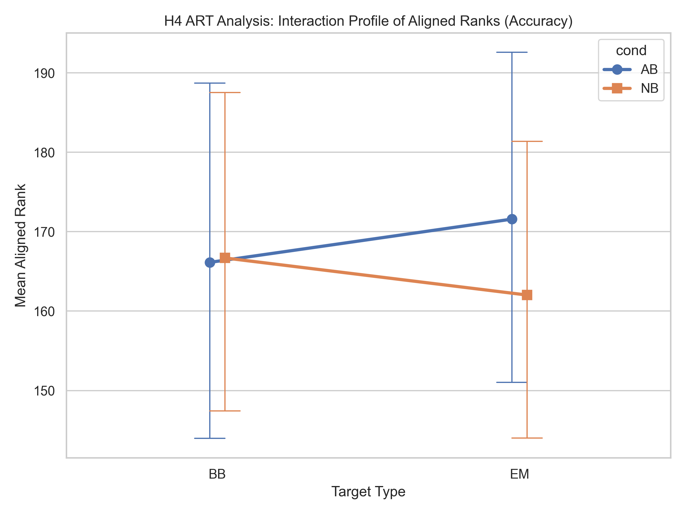
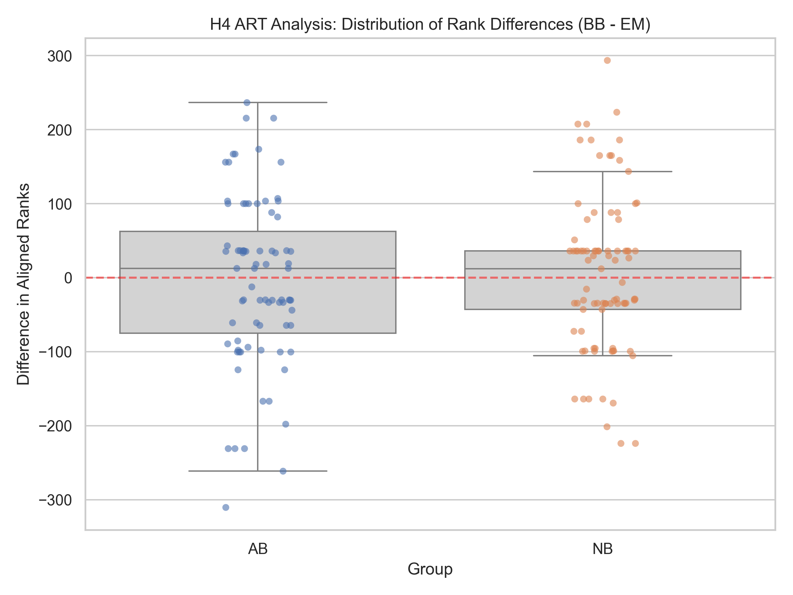
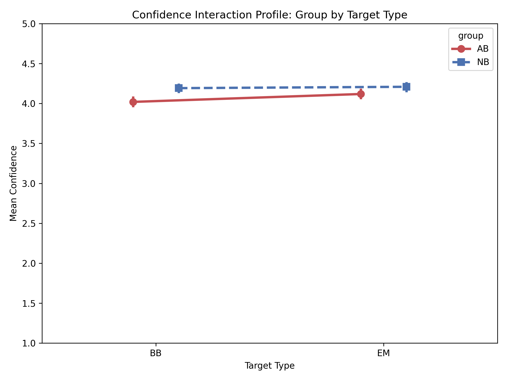
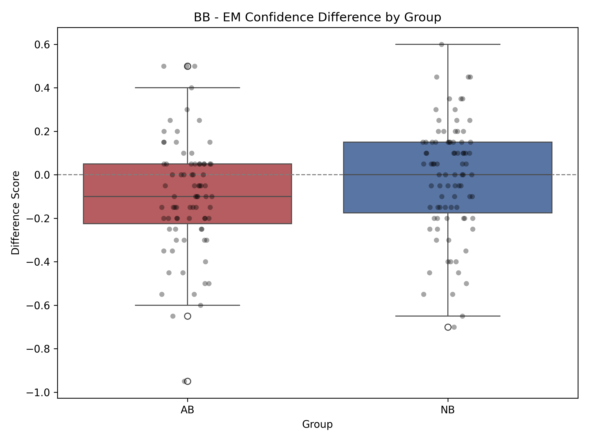
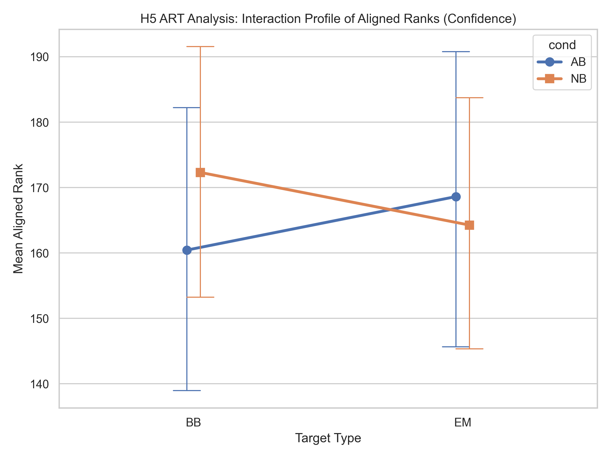
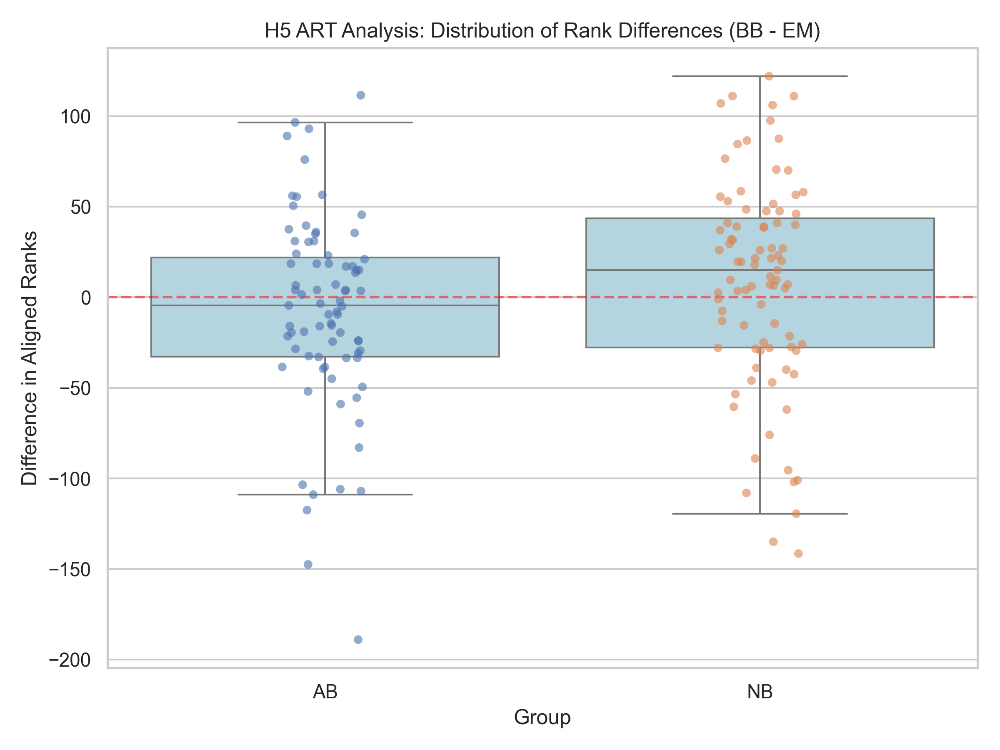

 # Hypothesis 4 and 5 Analysis Report

## Hypothesis 4: Interaction Effect on Accuracy

We wanted to see if the difference in accuracy between BB and EM targets changed depending on which group the participant was in. To test this, we calculated a difference score for each participant by subtracting their EM accuracy from their BB accuracy.

### 1. Normality Test
We used the Shapiro-Wilk test to see if these difference scores followed a normal distribution. 
* Natural cut group: W = 0.966, p = 0.023
* Abrupt cut group: W = 0.968, p = 0.043

Both p-values are below 0.05, meaning the accuracy difference scores are not normally distributed. This justified moving forward with non-parametric testing.

### 2. Mann-Whitney U Test
Because the data was not normal, we used a Mann-Whitney U test to compare the difference scores between the two groups. The results showed no significant difference (U = 3476.5, p = 0.897). This tells us that the group a participant was in did not significantly impact how their accuracy changed from BB to EM targets.

### 3. Aligned Rank Transform (ART) ANOVA
Testing difference scores with a Mann-Whitney U test is a simplified way to look at interactions. To be absolutely sure about our findings, we also ran an ART ANOVA. This method aligns the data to isolate the interaction before ranking it, making it well suited for a 2x2 mixed design with non-normal data.

The ART analysis resulted in a t-statistic of 0.593 and a p-value of 0.554. This confirms the initial Mann-Whitney U test result. There is no significant interaction between group and target type on accuracy.

## Hypothesis 5: Interaction Effect on Confidence

Next, we looked at the exact same interaction, but for participant confidence instead of accuracy. We created a difference score by subtracting EM confidence from BB confidence.

### 1. Normality Test
We ran the Shapiro-Wilk test on the confidence difference scores.
* Natural cut group: W = 0.980, p = 0.197
* Abrupt cut group: W = 0.977, p = 0.153

The p-values are greater than 0.05, which suggests the difference scores are roughly normal. However, confidence was measured on an ordinal Likert scale. To be safe and to keep our methods consistent with the rest of the study, we decided to stick with non-parametric tests.

### 2. Mann-Whitney U Test
We ran a Mann-Whitney U test to compare the confidence difference scores between the Natural and Abrupt cut groups. This test returned a significant result (U = 4151.0, p = 0.021). Based on this test alone, it looks like the drop in confidence from BB to EM targets is different depending on the group.

### 3. Aligned Rank Transform (ART) ANOVA
Just like with accuracy, we ran the ART ANOVA to verify the interaction on confidence. 

The ART test gave a t-statistic of 1.870 and a p-value of 0.063. A p-value of 0.063 is just outside the standard 0.05 cutoff for statistical significance. This means the interaction effect we saw in the first test is marginal when we use a more strict method that accounts for the mixed design structure. The initial finding might have been slightly inflated by rank distributions, so the interaction is not entirely conclusive.

