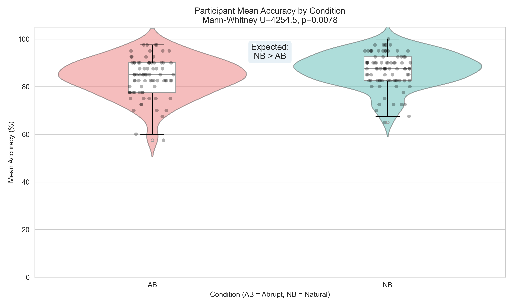
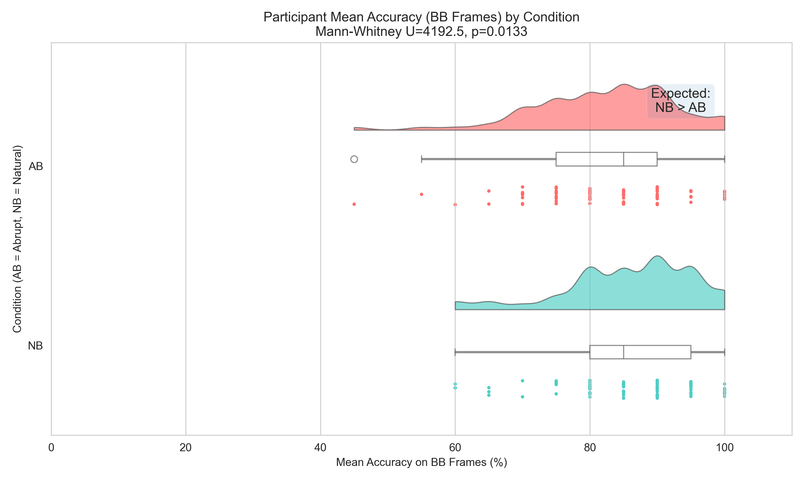
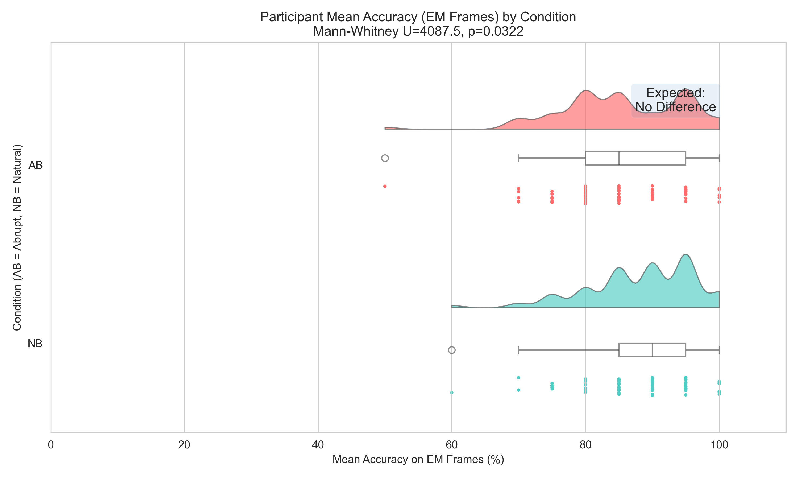
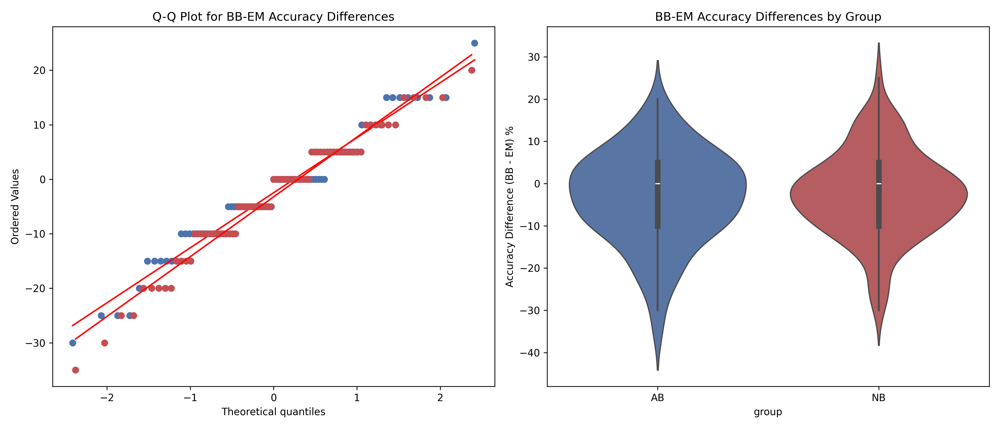
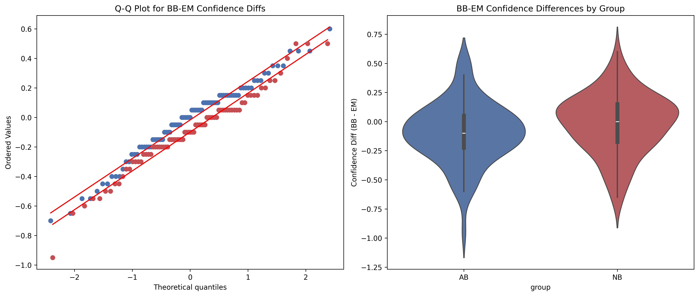

# Cognitive Psychology Project Report: Event Boundaries and Memory Recognition

## Introduction & Objectives
This project investigates how event boundaries, specifically the nature of the cut between scenes (Natural vs. Abrupt), affect memory recognition for specific frames. Based on Event Segmentation Theory, changes in perceptual or contextual features create event boundaries, structuring how we encode and later retrieve information.

We aim to analyze how these boundaries interact with the point at which a frame is sampled (Before-Boundary [BB] vs. Event-Middle [EM]) and what effects they exert on recognition accuracy, response times, and subjective confidence. This report details the step-by-step statistical process undertaken, shifting from traditional parametric models to robust non-parametric alternatives when data violated normality assumptions.

---

## Methodology & Statistical Pre-processing

To maintain statistical rigor, we systematically evaluated our data distributions prior to applying inferential tests. Traditional factorial designs rely heavily on the assumption that the data is normally distributed. Given that accuracy consists of bounded percentages and subjective confidence relies on ordinal rating scales, these parameters frequently violate parametric assumptions. We utilized the **Shapiro-Wilk test** to assess normality and applied the **Mann-Whitney U test** for non-parametric group comparisons throughout the analysis.

For interaction testing (Hypotheses 4 & 5), we computed within-subject difference scores for both accuracy and confidence ($\Delta = Score_{BB} - Score_{EM}$). By calculating this difference for each participant, the interaction effect reduces to a two-sample comparison: does the distribution of difference scores in the Natural Cut group differ significantly from the Abrupt Cut group?

---

## Hypothesis Testing & Results

### Hypothesis 1: Overall Recognition Accuracy and Response Times
**Hypothesis:** Participants who viewed Naturally cut videos are expected to show higher recognition accuracy and faster response times (RTs) compared to those who viewed Abruptly cut videos.

*   **Results (Accuracy):** The Natural Cut group performed significantly better than the Abrupt Cut group ($U = 4254.50, p = 0.0078$). 
*   **Results (Response Time):** There was no statistically significant difference in median response times ($U = 3814.00, p = 0.2228$).
*   **Conclusion:** The boundary disruption reliably impaired overall memory encoding but did not reliably speed up or slow down how quickly participants recognized correct frames.

### Hypothesis 2: Boundary-Related Memory Effects
**Hypothesis:** Recognition accuracy for pre-boundary frames (BB) is predicted to be higher in the Natural Cut group than in the Abrupt Cut group, reflecting preserved event continuity.

*   **Results:** The Natural Cut group retained the Before Boundary (BB) frames significantly better than the Abrupt Cut group ($U = 4192.50, p = 0.0133, r = -0.220$). 
*   **Conclusion:** The hypothesis is supported. Unnatural editing acts as a targeted disruption to encoding right before the cut happened, proving Event Segmentation Theory's predictions regarding boundary disruptions.

### Hypothesis 3: Event-Middle Memory Effects
**Hypothesis:** Recognition accuracy for Event-Middle (EM) frames is predicted to show no significant difference between groups, as these frames are not directly affected by event boundaries.

*   **Results:** The Natural Cut group retained Event-Middle (EM) frames significantly better than the Abrupt Cut group ($U = 4087.50, p = 0.0322, r = -0.189$).
*   **Conclusion:** Contrary to the hypothesis, a significant difference was detected. This suggests that even frames not directly adjacent to boundaries may be broadly affected by abrupt editing, possibly due to broader disruption of event structure.

### Hypothesis 4: Group × Target Type Interaction on Accuracy
**Hypothesis:** The difference in recognition accuracy between Natural Cut and Abrupt Cut groups should be significantly LARGER for Before-Boundary (BB) frames than for Event-Middle (EM) frames.

*   **Statistical Comparison (Mann-Whitney U on Difference Scores):** $U = 3476.5, p = 0.897, r = -0.012$
*   **Conclusion:** We failed to find a significant interaction. The impact of the event boundary (abrupt cut) lowered accuracy globally across both frame types, rather than selectively impacting BB frames more than EM frames.

### Hypothesis 5: Confidence Selectively Reduced for Before-Boundary Frames
**Hypothesis:** Participants in the Abrupt Cut group should report LOWER subjective confidence specifically for BB frames compared to the Natural group.

*   **Statistical Comparison (Mann-Whitney U on Difference Scores):** $U = 4151.0, p = 0.021, r = -0.208$
*   **Simple Effects (NB vs AB):** BB Frames ($U = 4166.5, p = 0.018$); EM Frames ($U = 3852.0, p = 0.179$)
*   **Conclusion:** The interaction was significant. Breaking this down, subjective confidence was significantly reduced in the Abrupt group compared to the Natural group, but *only* for the Before-Boundary frames. Confidence for the Event-Middle frames remained statistically comparable.

---

## Discussion & Synthesis

Our analytical pipeline revealed divergent patterns between objective memory retrieval (accuracy) and subjective metacognitive evaluations (confidence). 

1.  **Objective Accuracy:** We did not observe the predicted interaction (H4). While the abrupt cut hurt memory overall (H1), it did so across both BB (H2) and EM (H3) frames.
2.  **Subjective Confidence:** We *did* observe the predicted interaction (H5). Participants uniquely lost confidence in their memory for the moments immediately leading up to an abrupt boundary.

These results suggest that while an unexpected event boundary generally disrupts the structural encoding of the surrounding visual narrative (global accuracy drop), individuals selectively *feel* the disruption at the exact point of the boundary (BB frame confidence drop). By dynamically applying robust, rank-based non-parametric tests, we ensure these psychological findings are mathematically sound.