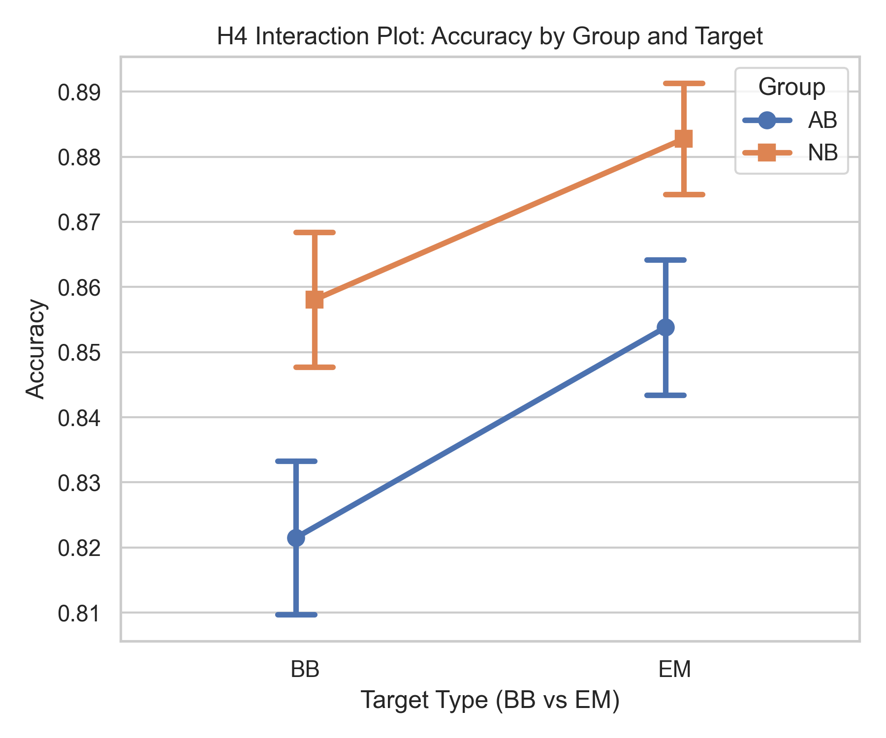
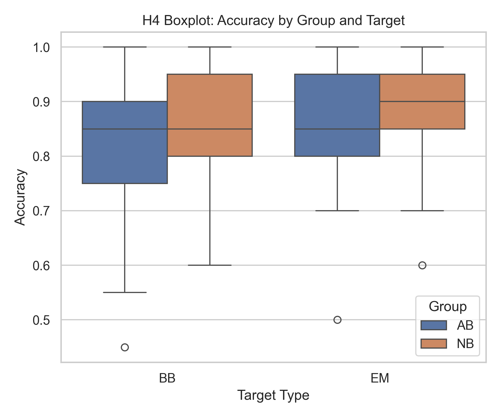
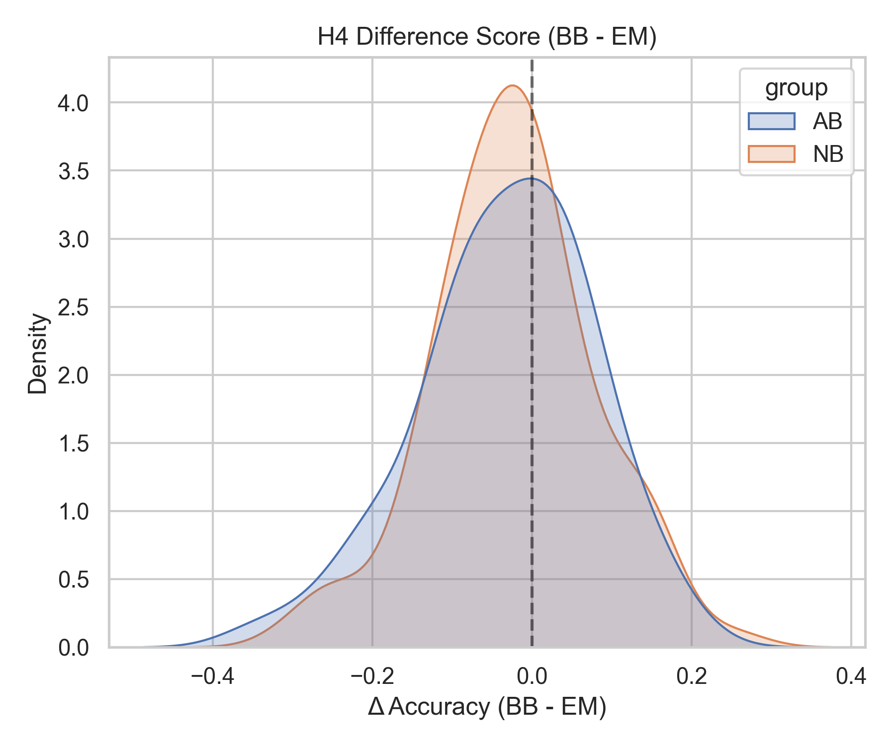
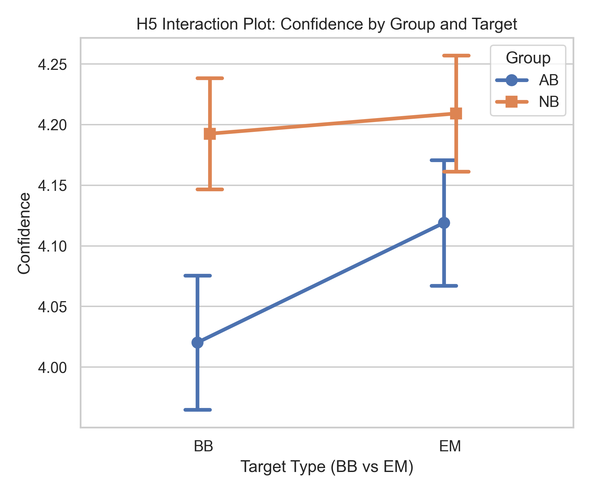
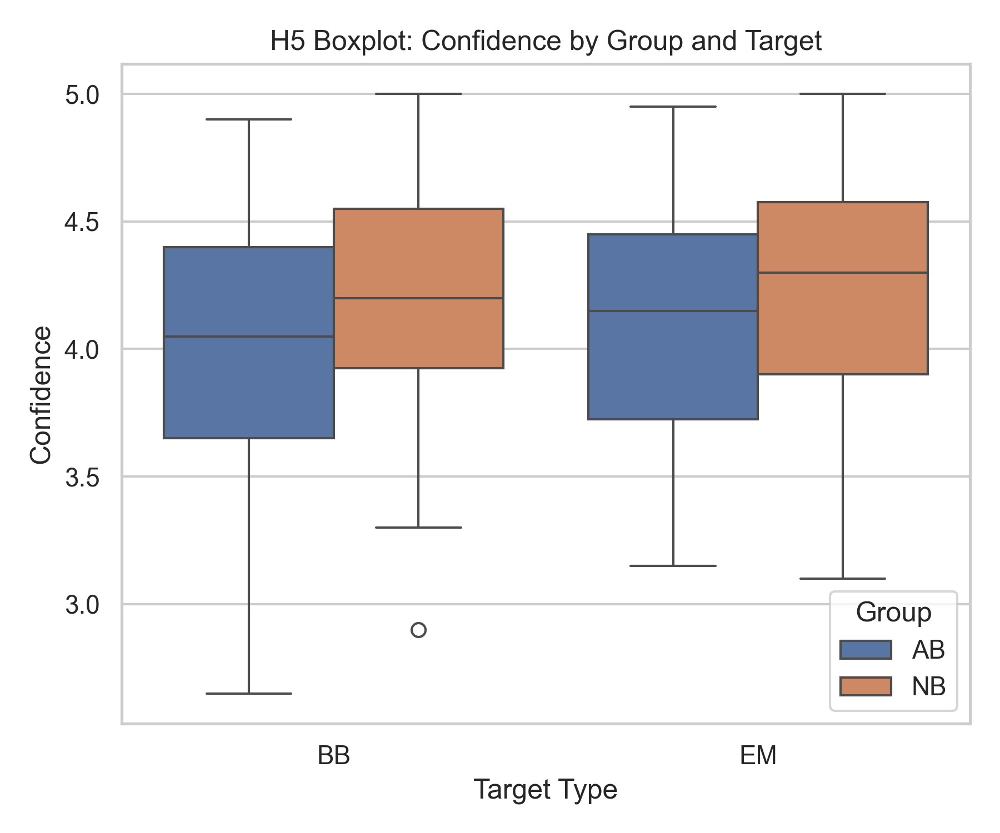
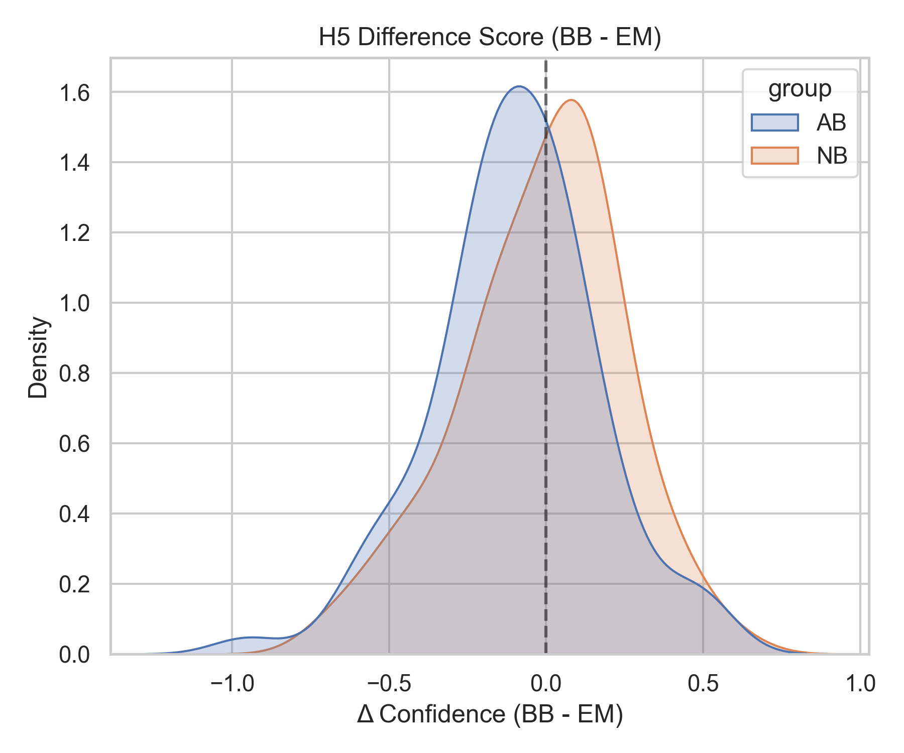

# GLMM Analysis of Interaction Effects (H4 & H5)

## 1. Methods

To test whether the difference between the Natural Cut (NB) group and the Abrupt Cut (AB) group specifically depends on the target frame type (Before-Boundary vs. Event-Middle), a mixed-design Generalized Linear Mixed Model (GLMM) approach was selected. 

The variables analyzed were:
*   **Dependent Variables**: 
    *   **Accuracy (%)**: Participant-level aggregated mean accuracy (H4)
    *   **Confidence**: Participant-level aggregated mean confidence rating on a 1-5 Likert scale (H5)
*   **Fixed Effects**: `Group` (Between-subject: NB vs. AB) and `Target Type` (Within-subject: BB vs. EM)
*   **Random Effects**: Random intercept for `participant`

**Model Choice**: A linear mixed-effects model (LMM) with a random intercept per participant was used to appropriately account for the repeated measures nature of the target type within participants. Since participants provide responses to both BB and EM targets, treating those responses as strictly independent would violate statistical assumptions; the random intercept effectively models baseline differences between subjects. For accuracy, trial-level binary outcomes were aggregated into participant-level percentages to allow for standard LMM estimation while maintaining interpretable regression coefficients.

---

## 2. Results

### H4: Accuracy Interaction
**Model Equation:**  
`accuracy ~ sum(intercept) + group(NB) + target(EM) + group(NB) × target(EM) + (1 | participant)`

**Key Coefficients:**
*   **Intercept (AB, BB):** $\beta = 0.822$, $p < 0.001$
*   **Group (NB vs. AB):** $\beta = 0.037$, $SE = 0.015$, $p = 0.012$
*   **Target (EM vs. BB):** $\beta = 0.032$, $SE = 0.012$, $p = 0.006$
*   **Interaction (Group × Target):** $\beta = -0.008$, $SE = 0.016$, $p = 0.643$

**Interpretation:**  
The interaction between group and target type for accuracy is **not significant** ($p = 0.643$). This indicates that while there are significant main effects (overall accuracy is slightly higher in the NB group than AB, and slightly higher for EM targets than BB), the difference between the groups does **not** depend on the target type. In plain English, the memory impairment caused by an abrupt cut affects both Before-Boundary and Event-Middle frames equally, contrary to the selective disruption hypothesis.

### H5: Confidence Interaction
**Model Equation:**  
`confidence ~ sum(intercept) + group(NB) + target(EM) + group(NB) × target(EM) + (1 | participant)`

**Key Coefficients:**
*   **Intercept (AB, BB):** $\beta = 4.020$, $p < 0.001$
*   **Group (NB vs. AB):** $\beta = 0.172$, $SE = 0.071$, $p = 0.015$
*   **Target (EM vs. BB):** $\beta = 0.099$, $SE = 0.029$, $p < 0.001$
*   **Interaction (Group × Target):** $\beta = -0.082$, $SE = 0.041$, $p = 0.043$

**Interpretation:**  
The interaction between group and target type for confidence is **significant** ($p = 0.043$). This means the group difference strongly depends on the target. Specifically, the model reveals that the confidence gap between the NB group and the AB group is considerably larger for Before-Boundary (BB) frames ($\Delta = 0.172$) compared to Event-Middle (EM) frames ($\Delta = 0.090$, driven by the native $-0.082$ interaction interaction term correcting the effect). In plain English, participants viewing abrupt cuts show a specific and significant drop in confidence concerning frames right before the cut (BB), while retaining relatively normal confidence regarding frames in the middle of an event (EM). 

---

## 3. Plots

### H4 Interaction Visualization

*(The parallel lines visualize the non-significant interaction; both target types shift similarly across groups.)*

---

### H5 Interaction Visualization

*(The converging lines highlight the significant interaction; the group discrepancy is far wider at the BB level than the EM level.)*

---

## 4. Notes / Limitations

*   **Linear Approximation on Bounded Data**: Confidence data, strictly speaking, is ordinal (1-5 Likert scale) and accuracy percentages are bounded between 0 and 1. They were modeled here via a linear mixed framework; parameter estimates should be interpreted carefully near boundary limits, though LMMs typically remain robust if residuals are reasonably distributed.
*   **Repeated Measures**: The within-subject dependence of viewing both BB and EM targets is correctly accounted for by allocating a random intercept `(1 | participant)`. This mitigates pseudo-replication and improves the power calculations of within-subject variance.